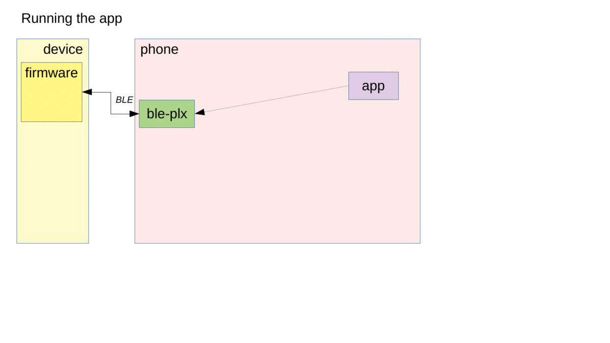

# Architecture of BLE mock recorder for react-native-ble-plx

## Diagram

- Light green: 3rd party code
- Dark green: part of this tool
- Purple: your code
- Grey: generated data

## Overview

When the app is running normally on the phone, it uses react-native-ble-plx to communicate over Bluetooth BLE with devices.

When testing the app, the react-native-ble-plx module is mocked with a version that playbacks traffic from a recording. This mock implements the same interface as the original module, plus a few methods to specify which recording to use, when to playback events, and optionally verify that the entire recording has been used when a test is complete. In this way you can use Jest and Testing Library like normally to test components and services that interacts with the device.

To make a recording, the react-native-ble-plx module is wrapped in a recorder, so that all commands and events are not only propagated to and from the original module, but also persisted in a recording file. The wrapper implements the same interface as the original module, plus a few methods to insert labels into recordings. You will create a recorder app, which can run through a number of scenarios, and create recordings for each.

To prevent recordings from having device-specific values in the recorded traffic, the wrapper also enables configuration of mappings for device names, characteristic values, etc. Through the wrapper you can also specify names for services and characteristics, which will be added to the recordings for easier debugging.

To create a recorder app, you can use the React Native template provided by this project. This will create a Mocha test runner app that can run on a phone connected to the device. You then write each of your recording scenarios as a Mocha test. Mocha was chosen for ease of embedding into a React Native app. When Jest Core has matured enough, it would make sense to add the option of using Jest instead of Mocha.

You will typicall add the recordings to git, so they are awailable for running app tests on your CI server. You will want to run the recording app whenever you change the set of scenarios, or the BLE protocol of the device changes. A good approach might be to generate new recordings on a weekly basis, plus as needed per feature branch.

## Recording format

Since the recording files are normally used by the same mock recording tool in its two modes (recording and playback), we can choose a file format that works well for this purpose. Some level of interoperability with other tools would be an added benefit.

Mock recording tools for HTTP traffic can use the W3C standard [HAR file format](<https://en.wikipedia.org/wiki/HAR_(file_format)>), also used by browser debugging tools to save traffic.

For BLE traffic we could have chosen the Bluetooth HCI log format as produced by Android and consumable by tools such a Wireshark. However, this format is quite low-level and expensive to implement correctly. Instead we have chosen a file format that closely mimics the API of the `react-native-ble-plx` module, making the tool easier to implement.

#### Recording mechanism

While _recording tests_ run on a real phone, the tool needs to store the recording file as an artifact on the developer machine. So after completing a recording, the tool has to send the recording file from the phone to the developer machine. It can do that in various ways, for example using the phone file system, or sending it to a server running on the developer machine. However, since the phone will already be attached to the developer machine running the recording test, the easiest approach is to utilize the system logging capabilities of phones (`console.log` and similar in React Native) which can be collected via tools such as `adb logcat` on Android and `idevicesyslog` on iOS.

#### Make the test control the mocking

Mock recording tools for HTTP traffic can rely on the inherent request-response nature of HTTP traffic: When the app sends a request, the tool will look in the recording for a matching request and will mock the corresponding response.

Since BLE traffic is inherently bi-directional, the approach needs to be a bit different. Just like the test has control over the _user actions_ during the scenario being tested, the test must also control the _device actions_. The tool uses two mechanisms to accomplish this: First, the recording file is _sequential_ - traffic is being simulated strictly in the order it was recorded. Secondly, interesting moments can be _labelled_ during the capture, allowing the test to simulate all traffic _up to_ a specified label.
