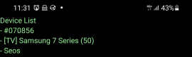
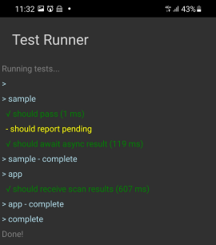
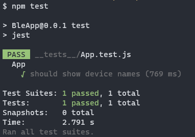

# Demo

This demo shows how to create a React Native app (which will display names of neaby BLE devices),
and then write fast and robust integration tests for this app using [react-native-ble-plx-mock-recorder](https://www.npmjs.com/package/react-native-ble-plx-mock-recorder/).

This is a fairly simple demo, so several features of the mock recorder are not shown. See the API documentation for details.

## Prerequisites

Please see [main README](../README.md#prerequisites).

## Bootstrap the app

You need an app, so that you have something to test. First, you bootstrap the app with React Native and install the react-native-ble-plx library so the app can talk with BLE devices:

```bash
mkdir ble-demo
cd ble-demo
npx react-native init BleApp
cd BleApp
npm install react-native-ble-plx
```

## Code the app

Then you write the code needed to actually talk with BLE devices:

- [`BleApp/App.js`](./BleApp/App.js)
- [`BleApp/ble.js`](./BleApp/ble.js)

## Run the app

You can now run the app (which will open a seperate terminal window with the React Native metro bundler):

```bash
npm run android
```

Your phone should show something like this, with names of BLE devices near you:



## Bootstrap the recorder test app

Now, before you can write a test for your app, you have to create a BLE traffic recorder app. You use a dedicated React Native template to bootstrap this recorder app:

```bash
cd ble-demo
npx react-native init BleAppRecorder --template react-native-ble-plx-mock-recorder-mocha-template
cd BleAppRecorder
```

## Code the recorder tests

To be able to record traffic, you will add a test to replicate (and verify) the traffic that you need for testing your real app:

- [`BleAppRecorder/src/test/app.recorder.test.js`](./BleAppRecorder/src/test/app.recorder.test.js)
- Change `expectedLocalName` to match your BLE device

## Run the recorder tests

First, you must stop the "metro" terminal window that popped up when you ran BleApp in a previous step. Then, you run the recorder app to record traffic:

```bash
npm test
```

Your phone will ask for the location permission, but please don't click it, as it will be clicked automatically.

Your phone should then show something like this:



If your phone is slow, you may get a timeout. You can increase it in [`BleAppRecorder/src/test/setup.test.js`](./BleAppRecorder/src/test/setup.test.js).

Now a [recording file](./BleAppRecorder/artifact/default.recording.json) will have been created in `BleAppRecorder/artifact/default.recording.json`.

## Set up app testing

To enable you to write a test for your real app, you must install the mock recorder tool, and you can also use [Testing Library](https://testing-library.com/):

```bash
cd BleApp
npm install react-native-ble-plx-mock-recorder
npm install @testing-library/react-native
```

For the benefit of `react-native-ble-plx`, you also have to modify the Jest configuration in `BleApp/package.json` to this:

```json
  "jest": {
    "preset": "react-native",
    "transformIgnorePatterns": [
      "node_modules/(?!(react-native|@react-native|react-native-ble-plx|react-native-ble-plx-mock-recorder)/)"
    ]
  }
```

And finally, you must add a Jest mock for `react-native-ble-plx`:

- [`BleApp/__mocks__/react-native-ble-plx.js`](./BleApp/__mocks__/react-native-ble-plx.js).

## Code the app tests

Now you can write a test for your app and have it use the recording you made earlier:

- [`BleApp/__tests__/App-test.js`](./BleApp/__tests__/App-test.js).
- Change `expectedLocalName` to match your BLE device.

## Run the app tests

Finally you can run your app test (and you can now also disconnect the phone and power down your BLE device as the BLE traffic is now being mocked by the recording you made):

```bash
npm test
```

Your terminal should show something like this:


